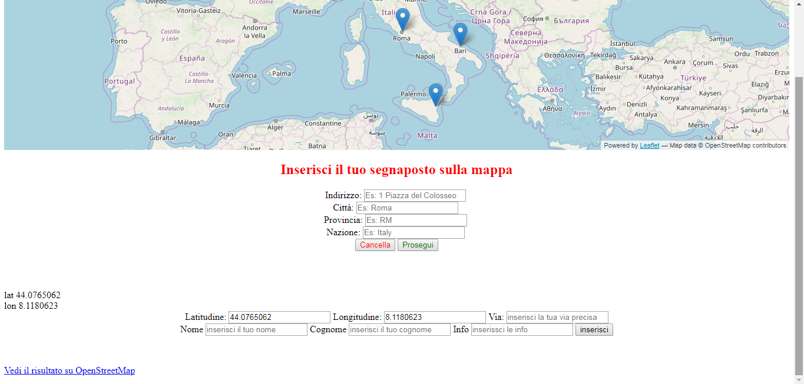
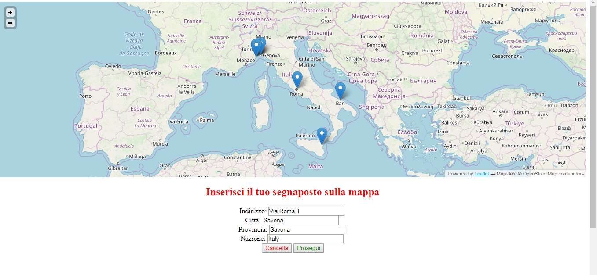

# OpenStreetMap-insert-coordinates-geocoding

How to insert geo coordinates in map from name adress?

 *IMPORTANT PHP version 5.5.38 warning at deprecate sintax*
 
To build map I used the following technologies:

- Frontend: markup and scripting languages HTML5, Javascript, JQuery (Library);
- Import map from leaflat js (https://leafletjs.com/);
- Geocoding: OpenStreetMap (https://www.openstreetmap.org/#map=5/45.768/11.382);
- Backend: programming language for PHP5 webserver interface;
- Database: MySql and PHP5;
 

<h1>Purpose of the program:</h1>

Have the user insert their placeholder on the map starting from the entry of an alphanumeric address .

 

Operation: The program, by importing from leaflat js, takes the map from the library and prints it on screen, then queries the database to find out if there are placeholders and inserts them on the same map, clicking on the placeholder will zoom the map in such a way as to be able to divide too many nearby markers and then separate them, clicking on the single placeholder will open an infowindow where the data entered by the user who registered his place will be present.

The user registration takes place in two moments: the first foresees that the latter enters either the street, or the city, if it wants the province, and the nation correctly inside the form, the second, once clicked on continue the data entered will make an http request to the OpenStreetMap site which will process them and find the coordinates (latitude and longitude), after which the page on which the request is made (this) will extract the coordinates from the OpenStreetMap site to insert them automatically on a form where it will be requested the user to enter the data he wants to put in the placeholder infowindow, once clicked on send the data will be allocated on his database webserver and will be displayed on the map. The page reloads with the placeholder just inserted.

If the street turns out to be poorly written, or for other reasons, the program cannot find the way and warns the user that if he wants he can always enter the its coordinates manually following the instructions.

 The deletion (the user has changed away or no longer wants to appear on the map or is wrong to enter the street ... etc.) is an option that I will consider once the definitive implementation method has been defined on the site of the master and therefore for now I have no such option.

This program is opensource and completely free, has some small limitations.

Invitation to take tests.
it is necessary to create a database.
I USED XAMPP V 5.5.38.

